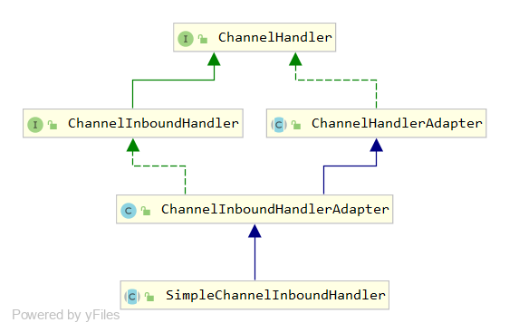
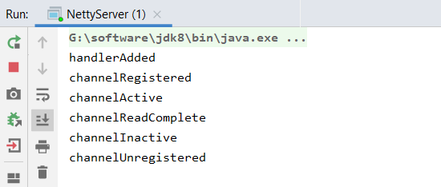
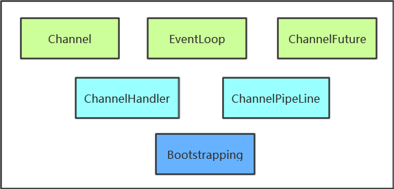
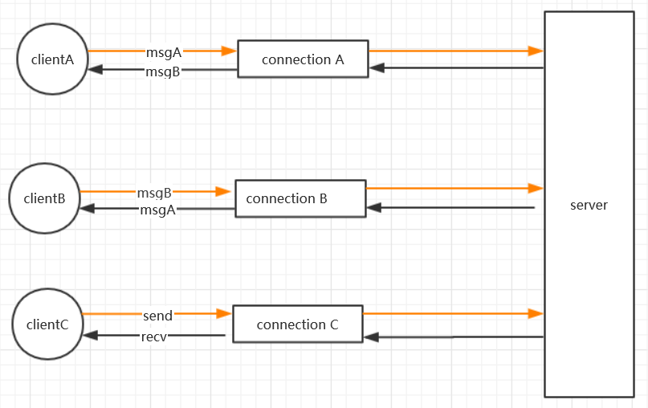
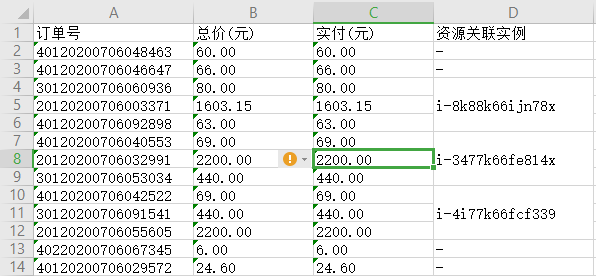

# 目录

* <a href="#1">netty 宏观概述</a>

* <a href="#2">netty 第一个应用程序</a>

* <a href="#3">netty 执行流程分析</a>

* <a href="#4">netty 重要组件介绍</a>

* <a href="#6">netty socket编程</a>

* <a href="#7">netty 多客户端通信</a>

* <a href="#8">netty 心跳检测机制</a>

* <a href="#9">netty websocket实现</a>

* <a href="#10">netty 集成protobuf通信</a>

* <a href="#11">Bio 与 Nio 详解</a>

* <a href="#12">Java nio 介绍</a>

* <a href="cmake">cmake 使用摘要</a>

* <a href="easyExcel">easyExcel 导出使用</a>


https://www.bilibili.com/video/av76127421


# <a name="1">netty 宏观概述</a>
## 1. netty 是什么

netty 的官网中有这么一句话

> Netty is an asynchronous event-driven network application framework for rapid development of maintainable high performance protocol servers & clients

简单理解 netty 是一个异步基于事件驱动的高性能网络框架，并且 netty 本身实现了大量的常见协议，简化了应用程序的开发

&nbsp; 

异步，与我们平常编写的代码有点不太一样，netty 中所有的请求都是异步的，对于请求结果、请求成功与否并不能马上返回，而是通过设置监听器回调来获得请求结果

事件驱动，所有的网络请求在网络通信里无非是 客户端发起连接 服务端接收连接 客户端发送数据 服务端接收数据 服务端发送数据，所以 netty 把这些当作一个一个事件进行处理，当有一个连接事件发生的时候，netty 会通过回调的方式告知应用程序 有客户端连接了

协议，netty 中另外一个重要的方面就是对协议的支持，在所有的网络应用程序编程，对于开发者最重要的就是制定协议，协议约定了客户端与服务器通信的数据格式，netyy 本身已经实现了很多的协议，例如 http协议、websocket协议、protobuf协议、fttp协议等

## 2. jdk NIO 

jdk 原生也有一套网络应用程序 API，因其不好用且存在很多问题，故 jdk 原生网络 API 在日常的开发中用的很少

* API 使用繁杂，需要熟练掌握 selector、serverSocketChannel、socketChannel 等API
* 辅助技能，必须熟练掌握 java 多线程开发，熟悉 Reactor 线程模型，才能开发出高质量的网络应用程序
* 网络异常处理难度大，常见的客户端断线重连、tcp 的粘包半包处理、网络闪断、网络拥塞等处理难度非常大
* jdk NIO bug，jdk NIO 本身存在的 Epoll bug 会导致 selector 空轮询，造成 cpu 100%

## 3. netty 特点
netty 是对 jdk NIO 进行了再次包装处理，简化 java 网络应用程序的开发

* netty 的 IO 模型和 Reactor 线程模型，使其具有很高的性能，IO 模型决定了netty 如何收发数据，Reactor 线程模型决定了 netty 如何处理数据
* netty 支持很多应用层协议，提供了很多的 decoder encoder
* netty 解决了 tcp粘包半包的问题
* netty 规避了 jdk NIO 本身的一些问题

## 4. netty 常见的应用

* Dubbo RPC 远程通信框架，默认使用 netty 作为通信基础组件
* Flink、Spark等经典的大数据应用程序，也是基于 netty 进行通信
* Moquette MQTT协议实现，基于 netty 进行协议的编码解码
* ......


&nbsp; 
# <a name="2">netty 第一个应用程序</a>

利用 netty 构建一个简单的 http 服务器，便是我们的第一个应用程序 

需求很简单，在浏览器的地址栏里输入 http://127.0.0.1:8080/ 并回车，然后显示 Hello World

这在以往用 SpringMvc 开发是轻而易举的事，然而使用 netty 开发一个简单的 hello world 应用程序，对于初学者来说并不是那么的轻松。接下来，将一步一步实现 netty 第一个应用程序的开发，了解 netty 的开发流程

&nbsp;

> 完整代码见  src/appone

&nbsp;

## 1.  项目结构

```
|-- appone
    |-- pom.xml
    |-- src
        |-- main
            |-- java
                |-- cnt
                    |-- HttpServerHandler.java
                    |-- NettyServer.java
                    |-- ServerInitializer.java
```

## 2. 编写代码

1. pom.xml 文件引入 netty jar 包依赖
```xml
 <dependency>
    <groupId>io.netty</groupId>
    <artifactId>netty-all</artifactId>
    <version>4.1.43.Final</version>
</dependency>
```

2. 编写 netty 服务端启动代码
```java
 public static void main(String[] args) throws Exception {
        EventLoopGroup bossGroup = new NioEventLoopGroup(); //[1]
        EventLoopGroup workGroup = new NioEventLoopGroup();
        try{
            ServerBootstrap serverBootstrap = new ServerBootstrap();//[2]
            serverBootstrap.group(bossGroup,workGroup)//[3]
                    .channel(NioServerSocketChannel.class)//[4]
                    .childHandler(new ServerInitializer())//[5]
                    .option(ChannelOption.SO_BACKLOG, 128)          // (6)
                    .childOption(ChannelOption.SO_KEEPALIVE, true); // (7);

            ChannelFuture channelFuture = serverBootstrap.bind(8080).sync();//[8]
            channelFuture.channel().closeFuture().sync();//[9]
        }finally {
            bossGroup.shutdownGracefully();//[10]
            workGroup.shutdownGracefully();
        }
    }
```
上面这段代码展示了 netty 服务端启动的一个基本步骤</br>

> ## 1. NioEventLoopGroup
> 初始化主从事件循环组，可简单理解为两个“线程池”，主线程池用于处理客户端的连接，从线程池用于网络 I/O 数据的收发


> ## 2. ServerBootstrap
> 初始化 ServerBootstrap ， 是 netty 服务端的启动类 , 聚合 netty 各种组件，完成 netty 服务器的启动

> ## 3. serverBootstrap.group
>设置 serverBootstrap 启动线程组

>## 4. serverBootstrap.channel
>设置 netty 服务器的 channel (通道) 类型

> ## 5. serverBootstrap.childHandler
>初始化客户端与服务端连接通道的数据处理器，一般包括数据的编码器、解码器、数据的业务逻辑处理器，ServerInitializer 是我们自定义的通道处理器初始化器

>## 6. serverBootstrap.option
>配置 ServerSocketChannel 通道的选项，即服务器生成用于接收客户端连接的通道选项

> ## 7. serverBootstrap.childOption
> 配置 socketChannel 通道的选项，客户端发与服务器连接通道的选项

> ## 8. serverBootstrap.bind(8080).sync()
> 绑定端口并等待接收客户端的连接

> ## 9. channelFuture.channel().closeFuture().sync()
> 等待服务器通道关闭


2. 编写自定义通道处理器初始化器
```java
public class ServerInitializer extends ChannelInitializer<SocketChannel> {
    protected void initChannel(SocketChannel socketChannel) throws Exception {
        ChannelPipeline pipeline = socketChannel.pipeline();
        pipeline.addLast("HttpServerCodecn",new HttpServerCodec());
        pipeline.addLast("HttpServerHandler",new HttpServerHandler());
    }
}
```
上面是通道初始化器的一个基本格式,主要就是添加各种 I/O 处理器

> ChannelInitializer：通道初始化器 需要继承 ChannelInitializer 并实现 initChannel 方法，SocketChannel 是一个可选的通道类型

> ChannelPipeline：Channel 是通过 ChannelPipeline 添加的处理器，对 I/O 数据处理。数据的处理流程一般为如下：</br>
客户端发送的数据 --> 数据解码器 --> 业务逻辑处理器 --> 数据编码器 --> 服务端发送数给客户端

> HttpServerCodecn: netty 本身已经实现的 http 协议编解码，包括 httpRequet 解码器 和 httpResponse 响应编码器

> HttpServerHandler：这个是我们自定义的业务逻辑处理器，这里只是简单的向浏览器 发送 Hello World

3. 自定义业务逻辑处理器
```java
public class HttpServerHandler extends SimpleChannelInboundHandler<HttpObject> {
    protected void channelRead0(ChannelHandlerContext channelHandlerContext, HttpObject httpObject) throws Exception {
        ByteBuf msg = Unpooled.copiedBuffer("Hello World", CharsetUtil.UTF_8);
        FullHttpResponse response = new DefaultFullHttpResponse(HttpVersion.HTTP_1_1, HttpResponseStatus.OK,msg);
        response.headers().set(HttpHeaderNames.CONTENT_TYPE,"text/plain");
        response.headers().set(HttpHeaderNames.CONTENT_LENGTH,msg.readableBytes());

        channelHandlerContext.channel().writeAndFlush(response);
    }
}
```
上面代码，定义了一个简单的业务逻辑处理器，向浏览器发送一串文字
> SimpleChannelInboundHandler : netty 定义了好几种入站处理器，供开发者根据需要选择不同的入站处理器接收数据并作出处理, SimpleChannelInboundHandler 是一个泛型，用于接收不同的数据格式，HttpObject 表示经过解码器的处理之后，转换成HttpObject 对应的数据格式，由于是 http 协议，故我们用 HttpObject 来存放浏览器的请求信息

> ChannelHandlerContext: 通道处理器上下文，获取到对应的 Channel 并向客户达发送数据

> FullHttpResponse: netty 定义的 http 响应数据格式

4. 启动服务，打开浏览器发送请求

> http://127.0.0.1:8080/ </br>
> 可以看到浏览器显示：  Hello World


5. 小结</br>
通过 Hello World 熟悉 netty 开发的一个基本步骤，主要分为三步
* 通过 ServerBootstrap ，启动 netty 服务器
* 编写 Channel 处理器初始化器，把 编码器、解码器、业务处理器等处理器加入到 ChannelPipeLine 对 I/O 数据进行处理
* 根据需要自定义编解码器、业务处理器


&nbsp; 
# <a name="3">netty 执行流程分析 </a>

从浏览器发送 http://127.0.0.1:8080/ 请求到服务器发送 Hello World 响应，期间发生了哪些事件，netty 的执行流程是怎么样的，还是以 Hello World 为例作一些调整进行阐述

> 完整代码见  src/apptwo

## 1.  项目结构

```
|-- apptwo
    |-- pom.xml
    |-- src
        |-- main
            |-- java
                |-- cnt
                    |-- HttpServerHandler.java
                    |-- NettyServer.java
                    |-- ServerInitializer.java
```

## 2. 修改 HttpServerHandler 代码
 
 自定义的 HttpServerHandler 继承了 SimpleChannelInboundHandler 并实现了其channelRead0 方法获取数据，可以发现 SimpleChannelInboundHandler 有如下的类图关系

 
 
 可以发现其父类定义了一系列的事件方法，故修改 HttpServerHandler 添加以下代码
 ```java
    @Override
    public void handlerAdded(ChannelHandlerContext ctx) throws Exception {
        super.handlerAdded(ctx);
        System.out.println("handlerAdded");
    }

    @Override
    public void channelRegistered(ChannelHandlerContext ctx) throws Exception {
        super.channelRegistered(ctx);
        System.out.println("channelRegistered");
    }

    @Override
    public void channelUnregistered(ChannelHandlerContext ctx) throws Exception {
        super.channelUnregistered(ctx);
        System.out.println("channelUnregistered");
    }

    @Override
    public void channelActive(ChannelHandlerContext ctx) throws Exception {
        super.channelActive(ctx);
        System.out.println("channelActive");
    }

    @Override
    public void channelInactive(ChannelHandlerContext ctx) throws Exception {
        super.channelInactive(ctx);
        System.out.println("channelInactive");
    }

    @Override
    public void channelReadComplete(ChannelHandlerContext ctx) throws Exception {
        super.channelReadComplete(ctx);
        System.out.println("channelReadComplete");
    }


    @Override
    public void exceptionCaught(ChannelHandlerContext ctx, Throwable cause) throws Exception {
        super.exceptionCaught(ctx,cause);
        System.out.println("exceptionCaught");
    }
 ```

## 3. 运行访问
打开浏览器访问，观察控制台输出将看到如下输出


根据输出结果，不难得出 channel 回调事件的执行顺序


&nbsp;
# <a name="4"> netty 重要组件介绍 </a>

熟知 netty 的核心组件，在开发中能更加的游刃有余，本节将对 netty 的核心组件做一个简单的介绍

## 1. 核心组件概览



## 2. Channel、EventLoop、ChannelFuture

`Channel`、`EventLoop`、`ChannelFuture` 是 netty 关于网络的抽象

* `Channel` ---> sockets

* `EventLoop` ---> control flow、multithreading、concurrency

* `ChannelFuture` ---> asynchronous notification

### 2.1 Interface Channel

网络的最基本操作

* bing() ---- 绑定端口

* connect() ---- 连接

* read() ---- 读数据

* write() ---- 写数据

在 java 中具体的实现是基于 java 网络套接字， 即 Socket 类

Channel 接口是对网络基本操作的再次抽象，相对于直接操作 Socket ，其主要目的是减轻开发的复杂度

目前 netty 提供的相关实现类主要有：

* EmbeddedChannel ---- Netty 提供的用于 ChannelHandler 数据入站出站过程的测试

* LocalServerChannel ---- Netty 提供的用于同一个 JVM 内部实现 client 和 server 的通信

* NioDatagramChannel ---- Netty 提供的用于 UDP 报文发送的 Channel

* NioSctpChannel  ----  Netty 提供的用于 sctp 协议的报文传输

* NioSockerChannel  ---- Netty 提供的用于 TCP 协议的报文传输


### 2.2 Interface EventLoop

EventLoop 是定义了如何处理一个连接在其生命周期内发生的事件

Channels、EventLoops、Threads、EventLoopGroups 关系

* 一个 EventLoopGroup 包含了一个或者多个 EventLoop

* 一个 EventLoop 在其生命周期会绑定一个线程

* 所有的 I/O 事件都会被 EventLoop 所绑定的线程所处理

* 一个 Channel 在其生命周期内会注册一个 EventLoop

* 一个 EventLoop 会被分配给一个或者多个 Channel

> netty 的这种设计，一个 Channel 的所有 I/O 将由同一个线程进行处理

### 2.3 Interface ChannelFuture

关于 I/O 的操作，在 netty 中全都是异步处理，要想知道 I/O 的操作结果是需要借助 netty 提供的 ChannelFuture，添加一个 ChannelFutureListener 进行监听


&nbsp;
# <a name="6">netty socket 编程 </a>

聊天程序大家都很熟悉，本节教程将利用 netty 构建一个简单聊天程序


> 完整代码见 src/appchat

## netty 客户端与服务器概览



## 项目结构
```
|-- appchat
    |-- pom.xml
    |-- src
        |-- main
            |-- java
                |-- cnt
                    |-- client
                    |   |-- Client.java
                    |   |-- ClientHandler.java
                    |   |-- ClientInitializer.java
                    |-- server
                        |-- HttpServerHandler.java
                        |-- NettyServer.java
                        |-- ServerInitializer.java
```


&nbsp; 
# <a name="cmake">camke 使用摘要 </a>

## 1. 认识CMake
一款优秀的工程构建工具

* 开放源代码，具有BSD许可
* 跨平台，支持 Linux 、Mac、Windows等不同的操作系统
* 编译语言简答，易用，简化编译构建过程和编译过程


## 2.CMake 语法主体框架

* 如何去组织一个项目的编译框架
* 最终输出目标有哪些（可执行程序、动态库、静态库）
* 如何配置输出目标文件的指定编译参数（需要哪些编译参数及环境、需要哪些源文件）
* 如何为指定的输出目标连接参数（怎么配置内外部依赖的pkg、lib，怎么链接外部库）


### 主体框架

* 工程配置部分

工程名、编译调试模式、编译系统语言

* 依赖执行部分

工程包、头文件、依赖库等

* 其他辅助部分（非必须）

参数打印、遍历目录等

* 判断控制部分（非必须）

条件判断、函数定义、条件执行等

--------------------------------------------------------------
1. 基本语法

> command(arg1 arg2 ...)  运行命令

> set(var_name var_value) 定义变量，或者给已经存在的变量赋值

> command(arg1 $(var_name)) 使用变量

--------------------------------------------------------------
2. 工程配置部分

> cmake_mini_required(VERSION num)  cmake 最低版本号要求

> project(cur_project_name)  项目信息

> set(CMAKE_CXX_FLAGS "XXX")  设置编译器

> set(CMAKE_BUILD_TYPE "XXX")  设定编译模式，如 Debug/Release

---------------------------------------------------------------
3. 依赖执行部分

> find_package(std_lib_name VERSION REQUIRED)   引入外部依赖

> add_library(<name> [lib_type] source1)   生成库类型（动态，静态）

> include_directories(${std_lib_name_INCLUDE_DIRS})  指定 include路径，放在 add_executable前面

> add_executeable(cur_project_name xxx.cpp)  指定生成目标

> target_link_library(${std_lib_name_LIBRARIES})  指定library路径，放在 add_executeable 后面

-------------------------------------------------------------

4. 其他辅助部分

> function(function_name  arg)  定义一个函数

> add_subdirectory(dir)  添加一个字目录

> AUX_SOURCE_DIRECTORY(. SRC_LIST)  查找当前目录所有文件，并保存到SRC_LIST变量中

> `FOREACH(one_dir ${SRC_LIST})
     MESSAGE(${one_dir})
  ENDFOREACH(onedir) `

> while(condition)
   command(args)
   endwhile(condtion)

---------------------------------------------------
5. 判断控制部分

```
if(expression)
    command(args)
else(expression)
   command(args)
endif(expression)
```
> if(var) 

> if(not var)

> if(var1 AND var2)

> if(COMMAND cmd)

> if(EXISTS file)


## 常用指令和变量

```
 PROJECT 
 ADD_EXECUTEABLE
 ADD_SUBDIRECTORY
 INCLUDE_DIRECTORY
 LINK_DIRECTORY
 TARGET_LINK_LIBRARIES
 ADD_LIBRARY
 AUX_SOURCE_DIRECTORY
 FOREACH
 MEAASAGE
 IF ELSE ENDIF
 WHILW ENDWHILE
 FIND_PACKAGE
 SET
 ```
> ADD_DEFINITIONS 

为源文件的编译添加 -D 引入的宏定义
命令格式 ADD_DEFINITIONS(-DFOO -DBAR)

> OPTION(<var> "description" [init_value])

提供用户可以选择的选项

> ADD_CUSTOM_COMMAND/TARGET

[COMMAND] 为工程添加一条自定义的构建规则
[TARGET] 用于给指定的名称的目标执行指定的命令，该目标没有输出，并始终被构建

> ADD_DEPENDENCIES

用于链接时依赖的问题，用于target_link_libraries 可以搞定？

当定义的target依赖的另一个target，确保在源代码编译本target之前，其他的target已经被构建

> INSTALL

用于定义安装规则，安装的内容可以包括目标二进制、动态库、静态库以及文件、目录、脚本等

> TARGET_INCLUDE_DIRECTORIES

TARGET_INCLUDE_DIRECTORIES(<target> [SYSTEM|BEFORE] <INTERFACE|PUBLIC|PRIVATE> [items])


设置 include 文件查找的目录，具体包含头文件应用形式，安装位置等


> SET_TARGET_PROPERTIES

设置目标的一些属性来改变他们的构建方式

> ENABLE_TESTING/ADD_TEST


CMAKE_INSTALL_PREFIX 构建install 的路径

$ENV{HOME} HOME 环境下的目录

PROJECT_NAME 工程名变量

<PKG>_INCLUDE_DIR 导入包头文件全路径

<PKG_LIBRARIES> 导入库文件的全路径

PROJECT_SOURCE_DIR 构建工程的全路径

CMAKE_VERSION cmake版本号

CMAKE_SOURCE_DIR 源码树的顶层路径


&nbsp; 
# <a name="mqtt">Mqtt3.1 报文格式 </a>

[mqtt协议](http://public.dhe.ibm.com/software/dw/webservices/ws-mqtt/mqtt-v3r1.html#fixed-header)


## mqtt 消息格式

* 固定头部

* 可变头部

* 消息体

### 固定头部
固定头部
<table border=2>
  <tr>
     <td>bit</td>
     <td>7</td>
     <td>6</td>
     <td>5</td>
     <td>4</td>
     <td>3</td>
     <td>2</td>
     <td>1</td>
     <td>0</td>
  </tr>

  <tr>
    <td>byte 1</td>
     <td colspan=4>Message Type</td>
     <td>DUP Flag</td>
     <td colspan=2>Qos Level</td>
     <td>RETAIN</td>
  </tr>

  <tr>
     <td>byte 2</td>
     <td colspan=8 align = center>Remaining Length</td>
  </tr>
</table>

#### Byte 1
Contains the Message Type and Flags (DUP, QoS level, and RETAIN) fields.
#### Byte 2
(At least one byte) contains the Remaining Length field.</br>

The fields are described in the following sections. All data values are in big-endian order: higher order bytes precede lower order bytes. A 16-bit word is presented on the wire as Most Significant Byte (MSB), followed by Least Significant Byte (LSB).

### Message Type

Mnemonic   | Enumeration | Description
---------  |-------------|------------
Reserved   | 0           |  Reserved  
CONNECT    | 1           | Client request to connect to Server
CONNACK    | 2           | Connect Acknowledgment
PUBLISH    | 3           | Publish message
PUBACK     | 4           | Publish Acknowledgment
PUBREC     | 5           | Publish Received (assured delivery part 1)
PUBREL     | 6           | Publish Release (assured delivery part 2)
PUBCOMP    | 7           | Publish Complete (assured delivery part 3)
SUBSCRIBE  | 8           | Client Subscribe request
SUBACK     | 9           | Subscribe Acknowledgment
UNSUBSCRIBE| 10           | Client Unsubscribe request
UNSUBACK   | 11           | Unsubscribe Acknowledgment
PINGREQ    | 12           | PING Request
PINGRESP   | 13           | PING Response
DISCONNECT | 14           | Client is Disconnecting
Reserved   | 15           | Reserved


### Flags

Name     | Description 
---------|-------------
DUP      | Duplicate delivery         
QoS      | Quality of Service   
RETAIN   | RETAIN flag   

> DUP
>> Position: byte 1, bit 3.</br>
>> This flag is set when the client or server attempts to re-deliver a `PUBLISH`, `PUBREL`, `SUBSCRIBE` or `UNSUBSCRIBE` message. This applies to messages where the value of QoS is greater than zero (0), and an acknowledgment is required. When the DUP bit is set, the variable header includes a Message ID.
The recipient should treat this flag as a hint as to whether the message may have been previously received. It should not be relied on to detect duplicates.

> QoS
>> Position: byte 1, bits 2-1.
>> This flag indicates the level of assurance for delivery of a PUBLISH message. The QoS levels are shown in the table below.</br>

QoS value | bit 2 |bit 1|Description
--------- |-------| ----|----------
0         | 0     | 0   |At most once, Fire and Forget，  <=1
1         | 0     | 1   |At least once, Acknowledged delivery，  >=1
2         | 1     | 0   |Exactly once, Assured delivery，  =1
3         | 1     | 1   |Reserved


> RETAIN
>>Position: byte 1, bit 0.</br>
This flag is only used on PUBLISH messages. When a client sends a PUBLISH to a server, if the Retain flag is set (1), the server should hold on to the message after it has been delivered to the current subscribers.</br></br>
When a new subscription is established on a topic, the last retained message on that topic should be sent to the subscriber with the Retain flag set. If there is no retained message, nothing is sent</br></br>
This is useful where publishers send messages on a "report by exception" basis, where it might be some time between messages. This allows new subscribers to instantly receive data with the retained, or Last Known Good, value.</br></br>
When a server sends a PUBLISH to a client as a result of a subscription that already existed when the original PUBLISH arrived, the Retain flag should not be set, regardless of the Retain flag of the original PUBLISH. This allows a client to distinguish messages that are being received because they were retained and those that are being received "live".</br></br>
Retained messages should be kept over restarts of the server.</br></br>
A server may delete a retained message if it receives a message with a zero-length payload and the Retain flag set on the same topic.

### Remaining Length

Represents the number of bytes remaining within the current message, including data in the variable header and the payload.


[mqttv3.3.1.1](http://docs.oasis-open.org/mqtt/mqtt/v3.1.1/os/mqtt-v3.1.1-os.html#_Toc398718030)


## 连接报文

<table border>
    <tr>
        <td rowspan = 3>请求头</td>
    </tr>
    <tr>
      <td rowspan=4>固定头</td>
    </tr>
    <tr>
        <td >可变头</td>
    </tr>


     
   
</table>


## clion ndk 配置

-DCMAKE_SYSTEM_NAME=Android
-DANDROID_NDK="G:\software\android-ndk-r20b"
-DCMAKE_TOOLCHAIN_FILE="G:\software\android-ndk-r20b\build\cmake\android.toolchain.cmake"
-DANDROID_PLATFORM="android-20"
-DANDROID_TOOLCHAIN="clang"
-DCMAKE_C_FLAGS="-fpic -fexceptions -frtti"
-DCMAKE_CXX_FLAGS="-fpic -fexceptions -frtti"
-DANDROID_STL="c++_static"


-DCMAKE_SYSTEM_NAME=Android
-DCMAKE_ANDROID_ARCH_ABI=armeabi-v7a
-DCMAKE_ANDROID_NDK=G:\software\android-ndk-r20b
-DCMAKE_SYSTEM_VERSION=16
-DCMAKE_C_FLAGS=""
-DCMAKE_CXX_FLAGS=""
-DCMAKE_ANDROID_NDK_TOOLCHAIN_VERSION=clang


# centos 安装jdk8

* 下载jdk8 链接：https://pan.baidu.com/s/1Q957PWk0d4wa3BQrt9IU2g 
提取码：vjd9

* 设置环境变量
vi /etc/profile

　export JAVA_HOME=/usr/local/bin/jdk1.8.0_221
　　export CLASSPATH=.:$JAVA_HOME/lib/dt.jar:$JAVA_HOME/lib/tools.jar
　　export PATH=$PATH:$JAVA_HOME/bin

* 使环境变量生效
source /etc/profile

# shell 图形界面登入

安装 yum install -y xterm

yum  install xorg-x11-xauth

yum install gdm

键盘输入变两个字符 的问题  Xconfig-Advance-Kkeyboard 勾掉


# clion 2019.3 激活
链接：https://pan.baidu.com/s/1bs9_4phDvMvCd-bOFkSoRg 
提取码：gosh 
复制这段内容后打开百度网盘手机App，操作更方便哦

# 安装 c/c++ 编译环境

yum install -y gcc gcc-c++ make automake

yum install centos-release-scl scl-utils-build
yum install -y devtoolset-8-toolchain
scl enable devtoolset-8 bash
echo "source /opt/rh/devtoolset-8/enable" >>/etc/profile
source /etc/profile


# cmake 安装

链接：https://pan.baidu.com/s/143G3_zMfyYmyOWD6aozr3A 
提取码：ryv2 
复制这段内容后打开百度网盘手机App，操作更方便哦

编译安装
./bootstrap --prefix=/usr --datadir=share/cmake --docdir=doc/cmake && make

报错
Could NOT find OpenSSL
yum install openssl openssl-devel

make install


# mariadb 

GRANT ALL PRIVILEGES ON *.* TO 'root'@'%'IDENTIFIED BY 'root' WITH GRANT OPTION;

flush privileges;

systemctl stop firewalld.service 

systemctl disable firewalld.service

# xshell 套件

链接：https://pan.baidu.com/s/1fSuEFG36bmeFe8Q8CBYB8A 
提取码：9drp 

ln -s /opt/rh/devtoolset-8/root/usr/bin/gdb   /usr/bin/gdb 


:cmake "/opt/project/source/mars/mars"
 -DCMAKE_SYSTEM_NAME=Android  -DANDROID_ABI="x86_64" -DCMAKE_BUILD_TYPE=Debug -DCMAKE_TOOLCHAIN_FILE=/usr/local/bin/android-ndk-r20b/build/cmake/android.toolchain.cmake -DANDROID_TOOLCHAIN=clang -DANDROID_NDK=/usr/local/bin/android-ndk-r20b -DANDROID_PLATFORM=android-14 -DANDROID_STL="c++_shared" 
 
 Release
 
 && cmake --build .  --config Debug -- -j8


1. 关闭用户图形界面
sudo systemctl set-default multi-user.target

sudo reboot

 

2. 开启用户图形界面
sudo systemctl set-default graphical.target

sudo reboot


sudo apt-get install net-tools  # 无法直接安装netstat


apt-get install openjdk-8-jdk


readelf -S  libmarsstn.so | grep debug


# <a name="easyExcel">easyExcel 导出使用</a>

excel 导出常见的类型主要有

* 固定标题头的导出

* 动态标题头的导出

如何使用 easyExcel 对这两种类型的导出

## maven 引入
```xml
 <dependency>
    <groupId>com.alibaba</groupId>
    <artifactId>easyexcel</artifactId>
    <version>2.2.5</version>
</dependency>
<dependency>
    <groupId>org.apache.poi</groupId>
    <artifactId>poi</artifactId>
    <version>3.17</version>
</dependency>
<dependency>
    <groupId>org.apache.poi</groupId>
    <artifactId>poi-ooxml</artifactId>
    <version>3.17</version>
</dependency>
<dependency>
    <groupId>org.apache.poi</groupId>
    <artifactId>poi-ooxml-schemas</artifactId>
    <version>3.17</version>
</dependency>
<dependency>
    <groupId>org.apache.poi</groupId>
    <artifactId>poi-ooxml</artifactId>
    <version>3.17</version>
</dependency>
```

1. 固定标题头的导出



固定标题头的导出直接采用实体类作为数据的载体，会比较方便

* 定义实体类
```java
public class OrderExportResponseVO {

	@ExcelProperty(value = "订单号",index = 0)
	@ColumnWidth(20)
	private String orderId;

	@ExcelProperty(value = "总价(元)",index = 1)
	@ColumnWidth(15)
	private String totalPrice;

	@ExcelProperty(value = "实付(元)",index = 2)
	@ColumnWidth(15)
	//@ContentStyle(shrinkToFit = true)
	private String payPrice;

		@ExcelProperty(value = "资源关联实例",index = 3)
	@ColumnWidth(20)
	private String relatedResourceId;
}
```
@ExcelProperty  定义标题头以及标题头的列 </br>
@ColumnWidth    定义excel 每一列的宽度


* 在我们的示例中最后一列有单元格的合并，故我们定义一个合并的处理器
```java
public class BillOrderExportCellMergeStrategy extends AbstractCellWriteHandler {

    /**要合并的列*/
	private static int  mergeColumnIndex = 17;
    /**从哪一行开始合并*/
	private static int mergeRowIndex = 2;

    /**忽略合并的值*/
	private static String ignoreCellValue = "-";


	@Override
	public void afterCellDispose(WriteSheetHolder writeSheetHolder, WriteTableHolder writeTableHolder,
								 List<CellData> cellDataList, Cell cell, Head head, Integer relativeRowIndex, Boolean isHead) {

		if(isHead) {
			return;
		}

		int curRowIndex = cell.getRowIndex();
		int curColIndex = cell.getColumnIndex();

		if (curRowIndex >= mergeRowIndex && curColIndex == mergeColumnIndex) {
			mergeWithPrevRow(writeSheetHolder, cell, curRowIndex, curColIndex);
		}

	}


	private void mergeWithPrevRow(WriteSheetHolder writeSheetHolder, Cell cell, int curRowIndex, int curColIndex) {

		Object curData = cell.getCellTypeEnum() == CellType.STRING ? cell.getStringCellValue() : cell.getNumericCellValue();
		Cell preCell = cell.getSheet().getRow(curRowIndex - 1).getCell(curColIndex);
		Object preData = preCell.getCellTypeEnum() == CellType.STRING ? preCell.getStringCellValue() : preCell.getNumericCellValue();

		if(curData == null || ignoreCellValue.equals(curData)){
			return;
		}

		if (curData.equals(preData)) {
			Sheet sheet = writeSheetHolder.getSheet();
			List<CellRangeAddress> mergeRegions = sheet.getMergedRegions();
			boolean isMerged = false;
			for (int i = 0; i < mergeRegions.size() && !isMerged; i++) {
				CellRangeAddress cellRangeAddr = mergeRegions.get(i);
				// 若上一个单元格已经被合并，则先移出原有的合并单元，再重新添加合并单元
				if (cellRangeAddr.isInRange(curRowIndex - 1, curColIndex)) {
					sheet.removeMergedRegion(i);
					cellRangeAddr.setLastRow(curRowIndex);
					sheet.addMergedRegion(cellRangeAddr);
					isMerged = true;
				}
			}
			// 若上一个单元格未被合并，则新增合并单元
			if (!isMerged) {
				CellRangeAddress cellRangeAddress = new CellRangeAddress(curRowIndex - 1, curRowIndex, curColIndex, curColIndex);
				sheet.addMergedRegion(cellRangeAddress);
			}
		}
	}
}

```

AbstractCellWriteHandler 是 easyExcel 提供的一个抽象类，每写一个单元格暴露给用户自行处理的接口

* 导出
```java

/**获取导出的数据*/
 Optional<List<OrderExportResponseVO>> orderVos = orderExportService.listExportOrder(orderListParamVo);
 List<OrderExportResponseVO> orderExportResponseVOList = orderVos.orElse(Lists.newArrayList());

/**设置excel名称*/
String excelName = "order"+".xls";
String sheetName = "包年包月";

/**数据导出*/
ByteArrayOutputStream outputStream = new ByteArrayOutputStream();
EasyExcel.write(outputStream, OrderExportResponseVO.class)
        .autoCloseStream(Boolean.FALSE)
        .registerWriteHandler(new BillOrderExportCellMergeStrategy())
        .sheet(sheetName)
        .doWrite(orderExportResponseVOList);

/**异步下载*/
asyncExportService.asyncExport(excelName, "application/octet-stream",  outputStream);

```

EasyExcel.write 将数据写入 Excel 并存到 outputStream，这里的 我们定义的是 ByteArrayOutputStream，也可以直接写入到 File 或者 response 的 outpStream</br>

registerWriteHandler 注册监听自定义的处理器，方便我们对 excel 再次处理

</br>


2. 动态标题头的导出


动态标题头，即标题头不是固定的，随着条件的变化而变化

* 定义标题头

我们的标题头是两行，且第一行是合并行，定义如下
```java
    private  List<List<String>> headList(String excelDate,List<String> regionNames){
        List<List<String>> headTitles = Lists.newArrayList();

        String basicInfo = "账单时间：" + excelDate;


        headTitles.add( Lists.newArrayList(basicInfo,"产品种类") );
        headTitles.add(Lists.newArrayList(basicInfo,"总费用"));
        if(CollectionUtils.isNotEmpty(regionNames)){
            for(String regionName : regionNames){
                headTitles.add(Lists.newArrayList(basicInfo,regionName));
            }
            return headTitles;
        }
        return headTitles;
    }

```
其中 List<String> 是定义每一列，有复合列的话，重复插入即可

* 获取列数据
 
对应标题头，按顺序设置每一列的数据
```java

List<List<String>> exportResultData = Lists.newArrayList();

List<String> rowData = Lists.newArrayList();
rowData.add("公网ip费用：元");
rowData.add("64739.40");
rowData.add("14124.9600");
rowData.add("50614.4400");

exportResultData.add(rowData);

...

```

* 设置行样式

在我们的示例中，每三行有一个样式的区别
```java

public class BillFinanceExportRowStyle extends AbstractCellStyleStrategy {

	private int nextStartStyleRowRatio =  1;
	private int lastStyleRow = 3;


	private WriteCellStyle headWriteCellStyle = null;
	private WriteCellStyle contentWriteCellStyle = null;

	private CellStyle headCellStyle;
	private CellStyle contentCellStyle;


	public BillFinanceExportRowStyle() {

		headWriteCellStyle = new WriteCellStyle();
		//headWriteCellStyle.setFillPatternType(FillPatternType.SOLID_FOREGROUND);
		headWriteCellStyle.setFillForegroundColor(IndexedColors.GREY_25_PERCENT.getIndex());
		WriteFont headWriteFont = new WriteFont();
		headWriteFont.setFontName("宋体");
		headWriteFont.setFontHeightInPoints((short)14);
		headWriteFont.setBold(true);
		headWriteCellStyle.setWriteFont(headWriteFont);


		contentWriteCellStyle = new WriteCellStyle();
		contentWriteCellStyle.setFillPatternType(FillPatternType.SOLID_FOREGROUND);
		contentWriteCellStyle.setFillForegroundColor(IndexedColors.GREY_50_PERCENT.getIndex());
	}

	@Override
	protected void initCellStyle(Workbook workbook) {

		if (headWriteCellStyle != null ) {
			headCellStyle = StyleUtil.buildContentCellStyle(workbook, headWriteCellStyle);
		}

		if (contentWriteCellStyle != null ) {
			contentCellStyle = StyleUtil.buildContentCellStyle(workbook, contentWriteCellStyle);
		}
	}


	@Override
	protected void setHeadCellStyle(Cell cell, Head head, Integer relativeRowIndex) {
		if (headCellStyle == null) {
			return;
		}
		cell.setCellStyle(headCellStyle);
	}


	@Override
	protected void setContentCellStyle(Cell cell, Head head, Integer relativeRowIndex) {
		if (contentCellStyle == null ) {
			return;
		}

		if((lastStyleRow+3) == relativeRowIndex && cell.getColumnIndex() == 0){
			nextStartStyleRowRatio = nextStartStyleRowRatio + 2;
			lastStyleRow = 3 * nextStartStyleRowRatio;
		}

		if(relativeRowIndex == lastStyleRow || (lastStyleRow+1) == relativeRowIndex || (lastStyleRow+2) == relativeRowIndex){
			cell.setCellStyle(contentCellStyle);
		}

	}
}
```

* 导出
```java
 ByteArrayOutputStream outputStream = new ByteArrayOutputStream();

ExcelWriter excelWriter   =   EasyExcel.write(outputStream)
        .head(headList)
        .registerWriteHandler(new BillFinanceExportRowStyle()).build();

WriteSheet writeSheet =    EasyExcel.writerSheet(sheetName).build();

/**设置列宽*/
Map columnWidth = new HashMap();
columnWidth.put(0, 10000);
for(int i =1; i <= regionIds.size(); ++i){
    columnWidth.put(0, 5000);
}
writeSheet.setColumnWidthMap(columnWidth);
excelWriter.write(exportResultData, writeSheet);
excelWriter.finish();
```


## ubuntu 安装 protobuf

* sudo apt-get install autoconf automake libtool curl make g++ unzip
* git clone https://github.com/google/protobuf.git
* cd protobuf
* ./autogen.sh
* ./configure
* make
* make install
* ldconfig      # refresh shared library cache.

## 配置动态链接库
* cd /etc/ld.so.conf.d  新增一个conf文件 包含目录

## 设置
export LD_LIBRARY_PATH=/usr/local/lib:${LD_LIBRARY_PATH}

####### add protobuf lib path ########
#(动态库搜索路径) 程序加载运行期间查找动态链接库时指定除了系统默认路径之外的其他路径
* export LD_LIBRARY_PATH=$LD_LIBRARY_PATH:/usr/local/protobuf/lib/
#(静态库搜索路径) 程序编译期间查找动态链接库时指定查找共享库的路径
* export LIBRARY_PATH=$LIBRARY_PATH:/usr/local/protobuf/lib/
#执行程序搜索路径
* export PATH=$PATH:/usr/local/protobuf/bin/
#c程序头文件搜索路径
* export C_INCLUDE_PATH=$C_INCLUDE_PATH:/usr/local/protobuf/include/
#c++程序头文件搜索路径
* export CPLUS_INCLUDE_PATH=$CPLUS_INCLUDE_PATH:/usr/local/protobuf/include/
#pkg-config 路径
* export PKG_CONFIG_PATH=/usr/local/protobuf/lib/pkgconfig/
######################################


cmake_minimum_required(VERSION 3.5)  
  
set(CMAKE_VERBOSE_MAKEFILE ON)  
  
SET(ROOT_PATH ".")  
SET(PROTO_DIR ${ROOT_PATH}/proto)  
  
  
#PROTOBUF_INCLUDE_DIR和PROTOBUF_LIBRARY两个变量必须设置，貌似可以随便设置，不设置但会提示让你设置，感觉像是bug  
SET(PROTOBUF_INCLUDE_DIR include)     
SET(PROTOBUF_LIBRARY .)   
  
SET(PROTOBUF_PROTOC_EXECUTABLE ../protoc.exe)  
  
#指向protobuf头文件的目录，里面的上层目录是<google>  
SET(THIRD_INCLUDE_DIR ${ROOT_PATH}/include)  
  
#包含protobuf头文件，这里必须设置，如果将PROTOBUF_INCLUDE_DIR指向protobuf头文件，而不设置include_directories，也会报错。  
include_directories(${THIRD_INCLUDE_DIR})  
  
file(GLOB PROTO_LIST ${PROTO_DIR}/*.proto)  
   
find_package(Protobuf REQUIRED)  
protobuf_generate_cpp(PROTO_SRCS PROTO_HDRS ${PROTO_LIST})  
add_library(mylib STATIC ${PROTO_SRCS} ${PROTO_HDRS})  
target_link_libraries(mylib)  


方法二： OpenSSL库的安装

　　  去官网下载最新版本 

　　官网：http://www.openssl.org

　　下载页面：http://www.openssl.org/source/

　　选择新版本下载 http://www.openssl.org/source/openssl-1.1.0         或者选择适合的版本，比如我这里需要使用到的是 openssl-1.0.2p

　　  tar -zxv openssl-1.0.2p.tar.gz

　　  cd openssl-1.0.2p/

　　  ./config 

　　  make && make install

　　  ./config shared 

　　  make clean

　　  make  && make install


# windows 查看端口号并杀死进程
netstat -ano|findstr "8080"
tasklist|findstr "20020"
taskkill /F /pid   20020


这个项目需要做什么？

最终目标是完成一个 类似微信的  聊天直播平台

支持web终  android app 终端   苹果手机终端   linux平台终端   windows平台终端  苹果电脑终端

第一步先完成在linux平台终端的文字 图片的发送

功能分为两部分  业务功能  和   支持业务的基础技术

[1] 连接
  连接的协议：请求连接   连接响应


[2]心跳


[3]


# MQTT 协议数据包格式
mqtt 协议由三部分组成

MQTT |            Description
---------        |-------
Fixed Header     | 固定头部 所有的报文都有    
Variable Header  | 可变头部 部分报文含有       
Payload          | 内容载体 部分报文含有

# 固定头部报文格式


其实就是怎么写sdk的问题

上层调用sdk  接口层

现在是linux 的sdk  要提供什么样的方式进行接入


客户端的mars 分为三层

具体的业务层

网络接口层 ： 负责对接业务层

网络层

stn层


C:\ProgramData\Microsoft\VisualStudio

C:\Program Files\dotnet

C:\Program Files (x86)\Microsoft SDKs

C:\Program Files (x86)\Microsoft SQL Server

C:\Program Files (x86)\Microsoft Visual Studio

C:\Program Files (x86)\NuGet

C:\Program Files (x86)\Windows Kits


C:\Program Files (x86)\Microsoft SDKs 
C:\Program Files (x86)\Microsoft Visual Studio 
C:\Program Files (x86)\Windows Kits 
C:\ProgramData\Microsoft\VisualStudio 
C:\ProgramData\Package Cache


# android 调试
本部分为 android 平台下开发对 mars c 代码进行如何调试的说明

本说明书完全是基于 ```ubuntu``` 操作系统环境之下，如在其他平台的操作系统，请自行根据情况修改


android ndk 的开发调试这里采用的是 gdb + gdbserver 的方式 </br>
涉及的开发软件：
* clion
* android-studio


## 1. jdk 环境变量安装

* 下载 jdk
>地址：https://pan.baidu.com/s/1Q957PWk0d4wa3BQrt9IU2g </br>
>提取码：vjd9  </br>
> 解压：将下载的 jdk 解压到 ```/usr/local/bin/``` 

* 设置 jdk 环境变量 </br>
 打开文件：vi /etc/profile 在文件的最后面增加   </br>
>export JAVA_HOME=/usr/local/bin/jdk1.8.0_221  </br>
export CLASSPATH=.:$JAVA_HOME/lib/dt.jar:$JAVA_HOME/lib/tools.jar  </br>
export PATH=$PATH:$JAVA_HOME/bin  </br>

* 使环境变量生效
> source /etc/profile


## 2. cmake 安装

* 下载 cmake
> 链接：https://pan.baidu.com/s/143G3_zMfyYmyOWD6aozr3A </br>
> 提取码：ryv2  

* 解压并编译
> ./bootstrap --prefix=/usr --datadir=share/cmake --docdir=doc/cmake && make

*如在编译的过程中找不到某些库，请根据提示安装对应的库文件，</br>
如：Could NOT find OpenSSL </br> 
则: apt install openssl openssl-devel*


* 安装
> make install


## 3. gcc g++ 编译环境安装
>apt-get install build-essential

## 4. 安装 python 2.7
> apt install python2.7

*如果系统存在 3.0 以上的 python版本 需要改为 2.7 的版本*

## 5. 安装 clion 

* 下载
>链接：https://pan.baidu.com/s/1GCgM-eY0B3WT6hFC8DhASQ </br>
>提取码：ihyg </br>

* 激活
>链接：https://pan.baidu.com/s/1bs9_4phDvMvCd-bOFkSoRg </br> 
>提取码：gosh </br>


## 6. 安装 ndk

* 下载 
>链接：https://pan.baidu.com/s/1xyFx7PPinD8PUawEEnf1zA  </br>
>提取码：5bsw </br>
> 解压：将下载的 jdk 解压到 ```/usr/local/bin/``` 

* 设置环境变量   vi /etc/profile
>export NDK_ROOT=/usr/local/bin/android-ndk-r20b </br>
> export PATH=$PATH:/usr/local/bin/android-ndk-r20b </br>

## 7. 安装 studio
* 下载 
> 链接：https://pan.baidu.com/s/1OOXtbiaOQvpM00xPMmFnrw </br>
> 提取码：kb7t </br>

* 设置 android sdk 环境变量 vi /etc/profile
> export PATH=$PATH:/usr/local/bin/android-sdk/platform-tools


</br> </br> </br>

# 调试过程
1. 启动 server 服务端 </br>
>进入 mars-demo/Server 目录执行  </br>
> python start_server.py </br>

2. 启动 clion </br>
载入 /mars 代码 </br>
 编译 android 平台的 so 库  采用 x86_64 的架构 </br>
 在clion的终端上执行： python  build_android.py  x86_64 x86_64
 编译出来的 so 库 存放在两个位置
 cmake_build 文件夹下 为可进行调试的 so库
 libraries 下为 release 版本 不含调试信息


3. 启动 android-studio </br>
载入 mars-demo/android/marsSampleChat 代码
将 clion  cmake_build 目录下的 so 库 拷贝到 
marsSampleChat -> SDK -> libs -> x86_64 

[注] android 模拟器的 api 版本 要对应为 x86_64

运行 marsSampleChat

在 ubuntu 终端上 运行 </br>
>adb  shell </br>
>进入 android 的shell 后 执行</br>
> su </br>
> 查看 marsService 运行的进程 pid </br>
> ps -a | grep mars  找到 marsService 进程的 pid 后 执行 </br>
> gdbserver64 :9091 --attach pid

在 ubuntu 上启动另外一个终端 运行
> adb forward tcp:9091 tcp:9091


clion  上设置 GDB Remote Debug 远程调试 </br> 
>GDB : 不要用默认的，默认的会有问题 </br>
'target remote' args : tcp:127.0.0.1:9091</br>

即可开始进程远程调试


